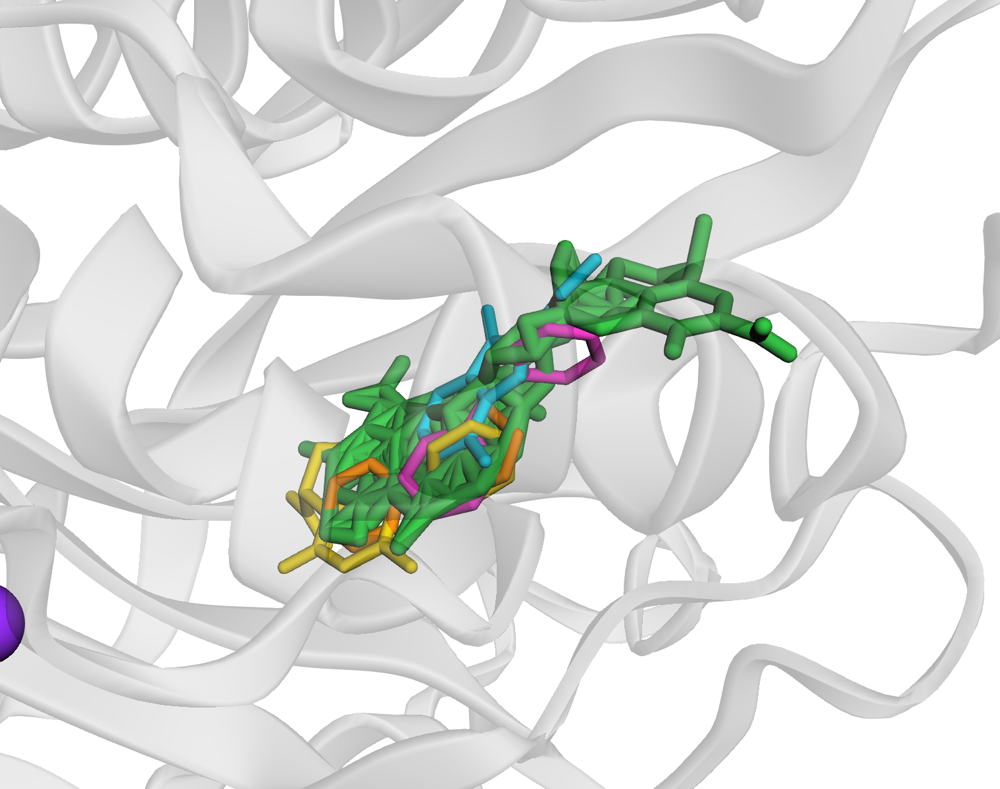
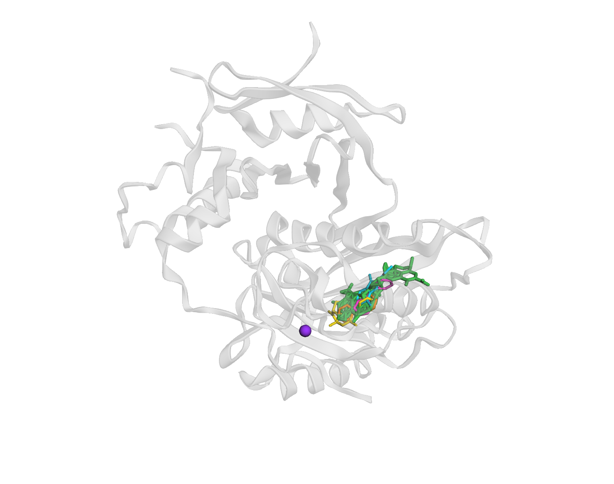

# L01 — Multi-copy 리간드 복합체 모델링 (CASP17 케이스 스터디)

CASP17 타겟 **L01 (BFT1, 아연 metalloprotease)** 에 [`../pipeline/`](../pipeline/) 본체를 적용·확장한 케이스 스터디입니다.
**80개 fragment 리간드**의 결합 구조를 3개 co-folding 모델(AlphaFold3·Boltz-2·Protenix) 합의로 예측하고, **실험 구조로 검증**했습니다.

> 이 저장소에서 가장 완결된 작업입니다: 문제 → 진단 → 해결 → **실험 검증** → 물리 정제까지.

---

## 왜 어려웠나 — single-copy 가정의 붕괴

대회 중반 업데이트로 요건이 바뀌었습니다:
- **모든 복합체에 촉매 아연(Zn) 1개** (receptor cofactor)
- **일부 리간드는 multi-copy** — 같은 fragment가 한 구조에 1~4개 결합 (stoichiometry 제공)

기존 파이프라인은 "리간드 1개"를 전제로 짜여 있어, **입력 → 포켓 정의 → 선정 → 제출** 전 사슬을 multi-copy + Zn에 맞게 개조해야 했습니다.

## 핵심 기여 — copy별 pocket 정의

가장 까다로운 문제는 pocket 정의였습니다.

```
결합 위치를 리간드 원자 전체의 무게중심 1개로 잡는 게 가장 단순.
리간드 1개면 OK ──▶ 하지만 copy 4개가 4곳에 흩어지면:
     전 원자 평균 = 아무 리간드도 없는 '허공' = 엉뚱한 pocket ❌
```

**해결**: 한 구조에서 copy를 잔기 단위로 분리 → **copy마다 무게중심(점)을 따로** 추출(구조당 N점) → copy 번호는 버리고 **위치 기반 그리디 클러스터링** → 점이 뭉친 곳 = 진짜 pocket.

→ 모델마다 copy 이름이 달라도(`l01`/`LIG1`/`LIG_B`) **타입·위치 기반**이라 견고. 상세: **[`docs/method_pocket_multicopy.md`](docs/method_pocket_multicopy.md)**

## 실험 기반 검증 — 정답 없이 신뢰도 확보

예측 pose가 "정답에 가까운가"를 CASP 정답 공개 전에 검증했습니다.

1. **실험 약물 overlap** — 예측 pose를 BFT 실험 약물결합 구조(PDB 7POL/7POU 등)에 단백질 정렬 → 리간드↔실험약물 거리 측정
   → **78/80이 실험 검증된 exosite 약물자리와 <3Å 적중**
2. **Zn 배치 검증** — His triad 배위 80/80, crystal Zn과 <2Å 일치 (co-folding Zn 배치 정확)
3. **화학적 정합** — 리간드 RDKit 분석: 80/80 fragment(MW<300), zinc-binding group 5/80 → exosite 결합이 화학적으로 타당함을 입증
4. **artifact 포착** — Zn 추가가 소수 fragment를 활성부위로 끌어당기는 현상을 검증으로 진단

### 시각화

|  |  |
|:--:|:--:|
| **예측 pose ↔ 실험 약물 겹침** — 대표 예측 리간드(청록·노랑·주황·자홍)가 실험 약물결합 구조(초록: 6JP/7X9/7WK)와 exosite에서 정렬. | **exosite vs 촉매 Zn** — 예측 리간드는 exosite(우측)에 모이고, 촉매 Zn(보라 구, 참조 구조)은 ~25Å 떨어져 있음. |

*예측 pose를 실험 구조(7POU)에 서열정렬(gemmi CA superposition, RMSD <1.3Å)로 올려 렌더 (open-source 3Dmol.js).*

## 물리 정제 — PoseBusters 100% clean

제출 pose의 물리 유효성(결합길이·각도·고리평탄·clash)을 PoseBusters로 검사 후 정제:

```
초기 114/132 ──gnina(clash)──▶ 125 ──MMFF(covalent 기하)──▶ 130 ──대체 pose 교체──▶ 132/132 ✅
```

---

## 결과 (Results)

| 축 | 결과 | 근거 파일 |
|---|---|---|
| 모델링 | 3모델 80/80 완료 | — |
| 선정 | 80/80, coverage N/N, clash-free | [`results/stage2_mc_selection_final.csv`](results/) |
| **위치 검증** | **78/80이 실험 exosite <3Å 적중** | [`results/exosite_overlap.csv`](results/) |
| Zn 검증 | 배치 80/80 정확 | [`results/pose_validation.csv`](results/) |
| **물리 검증** | **132/132 valid** (정제 후) | [`results/posebusters_final.csv`](results/) |

## 폴더 구성

```
L01/
├── README.md            (이 문서 — 케이스 스터디)
├── docs/
│   ├── method_pocket_multicopy.md   핵심 기여 심화
│   └── figures/                     구조 시각화
├── results/             선정·검증 결과 CSV (수치 근거)
└── scripts/             단계별 스크립트 (아래)
    ├── 01_inputs/       모델별 입력 생성 (count=N + Zn)
    ├── 02_inference/    추론 실행 (SLURM)
    ├── 03_collect/      3모델 합본
    ├── 04_pipeline/     pocket 발견 (copy별 centroid) + p2rank 검증
    ├── 05_select/       구조 단위 선정
    ├── 06_submission/   CASP LG 생성 (N copy + Zn)
    └── 07_validation/   pose 검증·정제 (exosite/Zn/PoseBusters/gnina/MMFF)
```

## 기술 스택

- **구조 예측**: AlphaFold3, Boltz-2, Protenix (co-folding)
- **구조 처리**: gemmi, RDKit / **정렬**: Kabsch (gemmi superposition)
- **검증·정제**: PoseBusters, gnina (singularity), p2rank, RDKit MMFF
- **시각화**: PyMOL / **인프라**: SLURM

## 참고 구조·문헌

PDB 7POL/7POO/7POQ/7POU (proBFT-3 + 약물), 3P24 (profragilysin-3) · 논문 [PMC9514063](https://pmc.ncbi.nlm.nih.gov/articles/PMC9514063/) (BFT-3 allosteric exosite 약물 결합).
