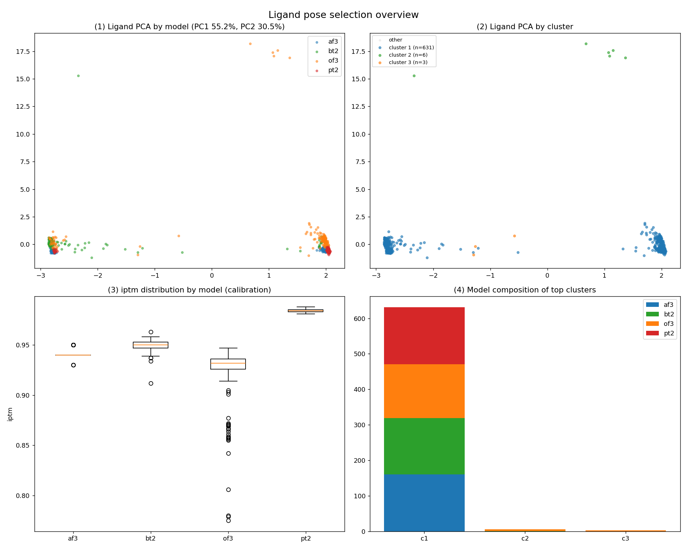

# T2411 — 아세트아닐리드 (HIGH)

단일 단백질 + 단일 리간드 pose 예측 예제. 파이프라인 자동 선정이 **HIGH 신뢰도**로 판정된 깔끔한 사례입니다.

## 입력
| | |
|---|---|
| 리간드 | **U08** (아세트아닐리드, N-phenylacetamide) |
| SMILES | `CC(=O)Nc1ccccc1` |
| Task | P (pose 예측) |

작은 방향족 아마이드 — 자유도가 낮아 모델 간 합의가 잘 잡히는 대표적 "쉬운" 케이스.

## 결과 — 🟢 HIGH
- **포켓 우세도 100%** (total 640), **4모델 합의**(af3·bt2·of3·pt2 각 160), af3 포함
- **pose 수렴 99%** — 사실상 모든 예측이 한 자리·한 방향으로 모임
- **p2rank 거리 2.82Å** (pass) — 선정 포켓이 실제 druggable cavity와 일치
- **PoseBusters 최종 전부 valid**, 정제 drift 최대 1.01Å (안정)
- 1순위 pose iptm **0.94**

> 판정 가이드: *합의·검증·유효성이 모두 일치 → 자동 선정 그대로 제출해도 무방.*

## 파일
`confidence_report.md`(판정) · `SELECTION_RATIONALE.md`·`selection_summary.csv`(선정 근거) · `figures/`(개요·접촉지문) · `model_1.cif`(최종 pose) · `submission/T2411LG_model1.txt`(제출)

