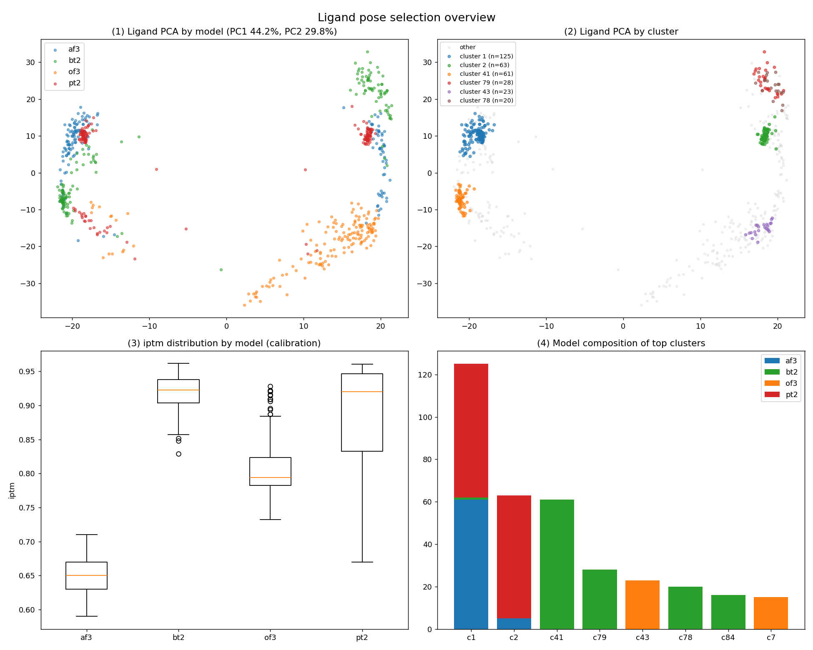

# T2412 — 트리아진–피페라진 (MEDIUM)

단일 단백질 + 단일 리간드 예제. 파이프라인이 **MEDIUM(검토 권장)**으로 플래그한 사례 — 신뢰도 시스템이 "무조건 통과"가 아님을 보여줍니다.

## 입력
| | |
|---|---|
| 리간드 | **DEL** (트리아진 코어 + 피페라진 2개 + CF₃) |
| SMILES | `CCN1CCCN(CC1)C1=NC(=NC(=C1)C(F)(F)F)N1CCCN(CC)CC1` |
| Task | P (pose 예측) |

유연한 회전결합이 많아 pose 방향이 잘 흩어지는 케이스.

## 결과 — 🟡 MEDIUM
- **포켓 우세도 100%** (total 640), 4모델 합의 — *자리(포켓)*는 확실
- **포켓 분리 P1/P2 = 319×** — 1순위 포켓이 압도적
- 그러나 **pose 수렴 21%** — 같은 포켓 안에서 *방향*이 흩어짐
- **p2rank 거리 7.14Å** (pass이나 다소 큼) — 포켓 중심이 cavity에서 떨어짐
- PoseBusters 전부 valid, 정제 drift 0.808Å, 1순위 iptm **0.96**

> 판정 가이드: *부분적으로만 일치 → 1~2순위 포켓 수동 확인, hedge 비중 조정 고려.*
> 자리는 맞지만 방향 수렴이 약해, 자동선정을 그대로 믿기보다 사람이 한 번 보라는 신호.

## 왜 T2413(HIGH)과 갈렸나
T2413도 pose 수렴 21%로 같지만 **p2rank 2.01Å**로 cavity와 일치 → HIGH. T2412는 **7.14Å**라 위치 근거가 약해 MEDIUM. 판정이 단일 점수가 아니라 **위치 검증까지 종합**한다는 예시.

## 파일
`confidence_report.md` · `SELECTION_RATIONALE.md`·`selection_summary.csv` · `figures/` · `model_1.cif` · `submission/T2412LG_model1.txt`

