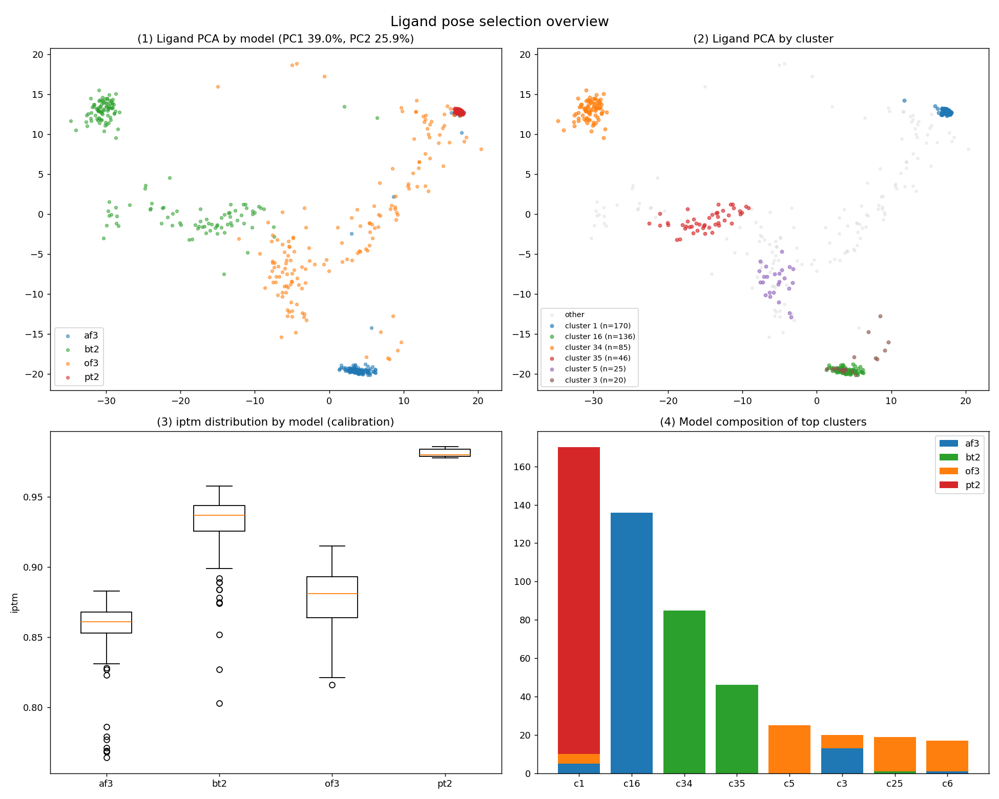

# T2413 — 글리코사이드 (HIGH)

단일 단백질 + 단일 리간드 예제. 크고 복잡한 리간드인데도 파이프라인이 **HIGH 신뢰도**로 수렴한 사례입니다.

## 입력
| | |
|---|---|
| 리간드 | **LIG** (다중 하이드록실 글리코사이드형 대형 분자) |
| SMILES | `COC(O)C[C@@H](C1C(O)CC(O)C2C1O[C@H](C1CC[C@H](O)[C@@H](O)C1)[C@@H](O)[C@H]2O)[C@H]1CNN[C@H]1C1CCCCC1` |
| Task | P (pose 예측) |

여러 stereocenter·OH를 가진 큰 분자 — 일반적으로 예측이 어려운 축에 속함.

## 결과 — 🟢 HIGH
- **포켓 우세도 100%** (total 640), **4모델 합의**(af3·bt2·of3·pt2), af3 포함
- **포켓 분리 P1/P2 = 639×** — 1순위 포켓이 사실상 유일
- **p2rank 거리 2.01Å** (pass) — cavity와 정확히 일치
- **PoseBusters 최종 전부 valid**, 정제 drift 0.865Å (안정)
- 1순위 pose gnina −10.2 (강한 결합 점수), iptm 0.869

> 판정 가이드: *합의·검증·유효성이 모두 일치 → 자동 선정 그대로 제출해도 무방.*
> 분자가 커도 위치·검증 근거가 탄탄하면 HIGH로 판정됨을 보여주는 예 (cf. [T2412](../T2412/)는 위치 근거가 약해 MEDIUM).

## 파일
`confidence_report.md` · `SELECTION_RATIONALE.md`·`selection_summary.csv` · `figures/` · `model_1.cif` · `submission/T2413LG_model1.txt`

