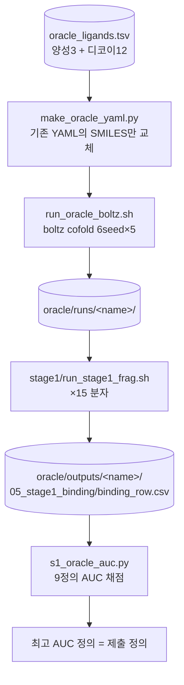

# oracle — Overview

## 목적
Stage1의 **9개 결합확률 정의 중 어느 것이 진짜 결합 분자를 가장 잘 골라내는지** 검증하여,
제출용 정의를 **취향이 아니라 근거(AUC)로 선택**한다.

- 정답 데이터(oracle) = **양성**(실험검증 억제제) + **음성**(디코이).
- 각 정의로 양성/음성을 얼마나 잘 가르는지 **AUC** 로 채점.

## 워크플로우

## 정답 세트 (15분자)
| 구분 | 개수 | 출처 |
|---|---|---|
| 양성 (결합 O) | 3 | BFT-3 논문(PMC9514063) 실험검증 억제제 (Flumequine, Foliosidine, Hesperetin) |
| 음성 (디코이) | 12 | 우리가 고른 일반 약물 (결합 안 할 가정) |

## 핵심 개념
- **AUC** = "양성이 음성보다 높은 점수 받을 확률". 양성3×음성12=36쌍 비교. 1.0=완벽, 0.5=랜덤.
- **대리(proxy) 검증**: 양성이 3개뿐 + 약물(fragment 아님) → 참고치. 실제 정답은 Stage2 때 공개.
- **파이프라인 재사용**: fragment와 동일하게 boltz→클러스터링→9정의. oracle 분자만 다름.

## 데이터 위치
- 스크립트: `pipeline/oracle/` (여기)
- 분자·결과: `<oracle 작업폴더>/` (oracle_ligands.tsv, smi/, affinity_yaml/, runs/, outputs/)
- 결과 정리: `<oracle 작업폴더>/ORACLE_검증_정리.md`
