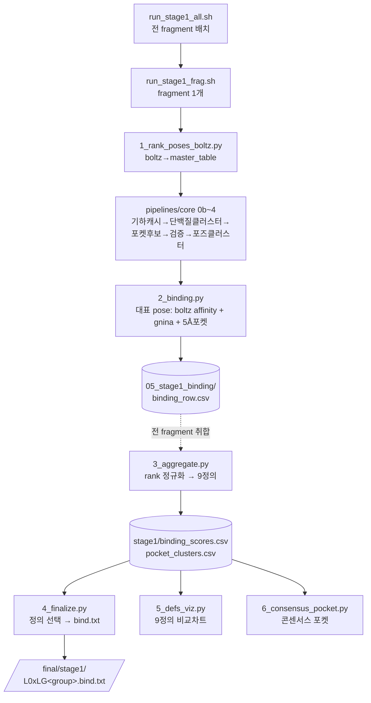

# stage1 — Overview

## 목적
CASP 리간드 시리즈 **Stage1** 산출물 생성:
fragment마다 (1) **결합확률**(0~1, 랭킹용), (2) **결합 포켓 잔기**(5Å) 를 계산해
제출 파일 `L0xLG<group>.bind.txt` 를 만든다.

- 입력: 팀 boltz cofold 결과 (fragment당 30 pose = 6 seed x 5 sample)
- 코어 클러스터링(0b~4)은 `pipelines/core/` 를 재사용, stage1은 **어댑터 + 스코어링 + 취합**만 담당.

## 워크플로우

## 2단계 구조 (중요)
- **per-fragment** (run_stage1_frag): 1_rank_poses_boltz → core 0b~4 → 2_binding → `binding_row.csv`
- **취합** (전 fragment 끝난 뒤): 3_aggregate(9정의 rank는 라이브러리 전체 필요) → 4_finalize/5/6

## 핵심 개념
- **결합확률 9정의**: boltz affinity + gnina(CNNscore/CNNaffinity/Vina) 조합을 rank 정규화한 9가지. 상세 [FEATURES.md](FEATURES.md).
- **대표 pose**: 30 pose를 2단계 클러스터링(포켓→포즈)해 뽑은 합의 구조 1개. gnina는 이 구조에만.
- **포켓**: 대표 pose 5Å 이내 잔기. 대부분 알로스테릭 Site B(A190~A268).
