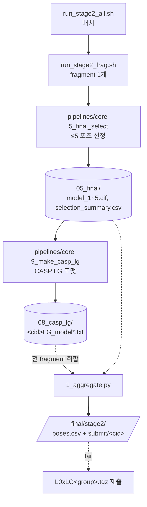

# stage2 — Overview

## 목적
CASP 리간드 시리즈 **Stage2** 산출물 생성:
Stage1에서 **실제 결합 확정된 fragment**에 대해 **수용체-리간드 복합체 포즈(≤5개)** 를 예측해
제출 tarball `L0xLG<group>.tgz` 를 만든다.

- **전제**: Stage1으로 fragment당 `00~04`(클러스터링)가 이미 있음. stage2는 그 04를 받아 **최종 선정 + 제출포맷**만.
- Stage2 입력(FASTA+SMILES)은 CASP가 Stage2 열 때 제공 = **결합 확정 fragment 목록(정답)**.

## 워크플로우

## Stage1과의 관계
- Stage1: 00 수집 → 01~04 클러스터링 → 05_stage1_binding(결합확률).
- Stage2: **같은 04를 재사용** → 05_final(선정) → 08_casp_lg(포맷). 클러스터링 반복 안 함.

## 핵심 개념
- **최종 선정(5_final_select)**: 04 포즈 클러스터 후보에 종합점수(합의·iptm·affinity)로 ≤5개.
- **제출 포맷(LG)**: 한 파일에 **수용체(PDB) + 리간드(MDL)** 합본. 개별 포즈 = `L0xxxxxLG<group>_N`.
- **제출 단위**: 실제 binder만. 전 fragment 아님.
